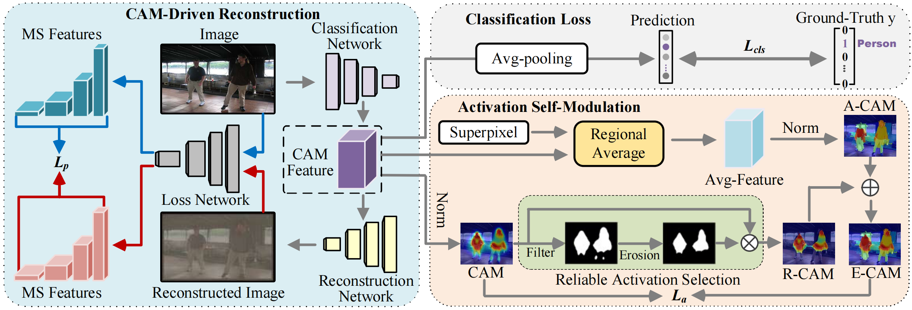

# Spatial Structure Constraints for Weakly Supervised Semantic Segmentation


Introduction
------------
This is the source code for our paper **Spatial Structure Constraints for Weakly Supervised Semantic Segmentation**

Network Architecture
--------------------
The architecture of our proposed approach is as follows


## Installation

* Install PyTorch 1.7 with Python 3 and CUDA 11.3

* Clone this repo
```
git clone https://github.com/weaklyseg/SSC.git
```

### Download PASCAL VOC 2012 

* Download [PASCAL VOC 2012](http://host.robots.ox.ac.uk/pascal/VOC/voc2012/#devkit)
* Download [Superpixel](https://wsss-ssc.oss-cn-shanghai.aliyuncs.com/voc_superpixels.zip)


## Testing the segmentation result
* Download our trained model [checkpoint_69.9.pth](https://wsss-ssc.oss-cn-shanghai.aliyuncs.com/checkpoint_69.9.pth) and put it in the `segmentation/data/models` folder

```
cd segmentation
python main.py test --config-path configs/voc12.yaml --model-path data/models/checkpoint_69.9.pth
python main.py crf --config-path configs/voc12.yaml
```

## Training

* Run run_sample.py (You can either mannually edit the file, or specify commandline arguments.) 
```
python run_sample.py
```
* After obtaining the pseudo labels, download the [pre-trained parameters](https://wsss-ssc.oss-cn-shanghai.aliyuncs.com/deeplab_init.pth)  and put it in the `segmentation/data/models` folder. Then train the segmentation model with pseudo labels . (You need to set the path for pseudo labels.)
```
cd segmentation
python main.py train --config-path configs/voc12.yaml
```
